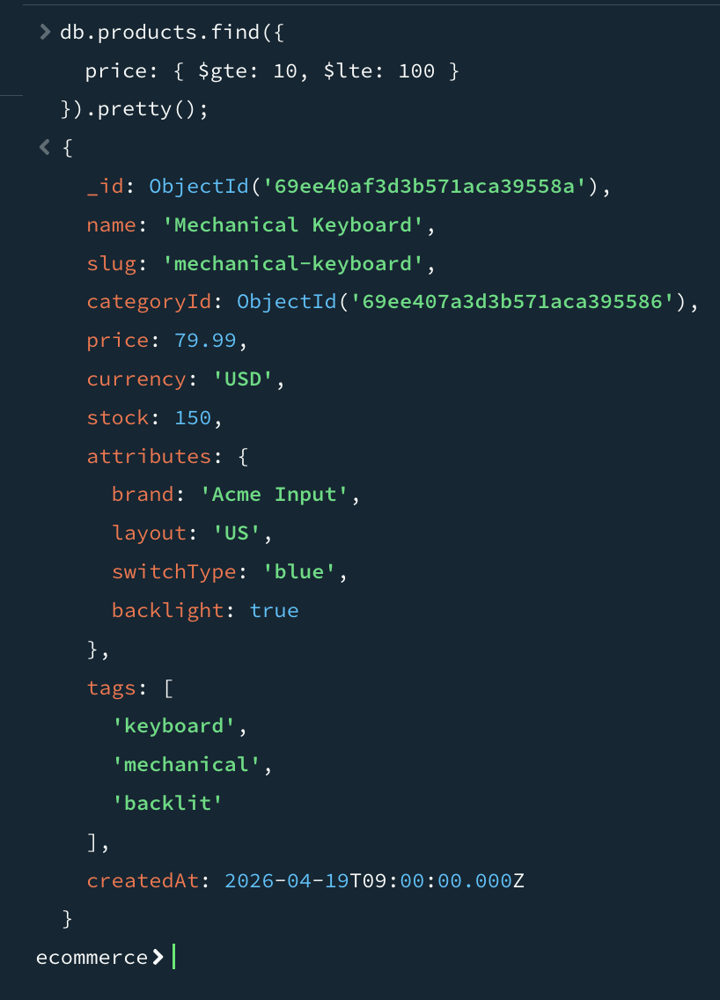
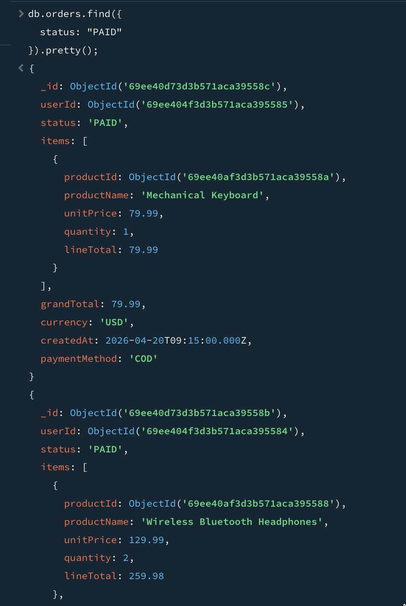

# DBS302 Practical 3 Report

## Title
Design and Implement an E-Commerce Platform Schema in MongoDB, Use Aggregation Framework, and Optimize Query Performance

## Aim
To design and implement an e-commerce platform schema using MongoDB, write advanced aggregation queries, and apply indexing plus query plan analysis to optimize performance.

## Objectives Achieved
1. Modeled a realistic e-commerce domain with users, categories, products, and orders.
2. Implemented the schema as MongoDB collections and inserted representative sample data.
3. Built non-trivial aggregation pipelines for business analytics.
4. Created indexes (compound and text) aligned to query patterns.
5. Used explain("executionStats") to validate optimization impact.

## Brief Design Rationale
1. Embedding vs Referencing
Order items are embedded in orders because they are read together and bounded per order.
Users, products, and categories are referenced by ObjectId to avoid duplication of shared entities.

2. Attribute Pattern for Catalog Flexibility
The products collection uses an attributes object for variable product properties (brand, color, switchType, etc.), which supports heterogeneous product categories.

3. Query-First Design
Indexes were created based on frequent read patterns such as status/date filtering, user order history, category listing, and product text search.

## Part 1: Database and Collection Setup
### 1.1 Create Database
```javascript
use ecommerce
```

### 1.2 Create Collections
Created collections: users, categories, products, orders.


This screenshot shows the commands used to create the required MongoDB collections for the e-commerce schema.


This output confirms that the `ecommerce` database is active and ready for data insertion.

## Part 2: Insert Sample Data
### 2.1 Insert Users
Inserted two users: Tashi Dorji and Sonam Choden.


This screenshot shows the insertMany command used to add user documents with profile and address details.


This output verifies that both user records were successfully inserted into the users collection.

### 2.2 Insert Categories
Inserted Electronics and Accessories categories using reusable ObjectId variables.


This screenshot shows category insertion with predefined ObjectId values for later product references.


This confirms that Electronics and Accessories categories were inserted correctly.

### 2.3 Insert Products
Inserted three products with variable attributes via the Attribute Pattern.


This screenshot captures product insertion using flexible `attributes` fields for different product properties.


This output confirms all sample products were added with category links and pricing details.

### 2.4 Insert Orders
Inserted two orders with embedded order items and historical pricing stored in each item.


This screenshot shows order creation with embedded items, quantities, line totals, and payment details.


This output verifies order documents were inserted successfully for both users.

## Part 3: Basic Retrieval Queries
### 3.1 Retrieve All Users


This query output displays all documents in the users collection for data verification.

### 3.2 Retrieve All Products


This output lists all products and confirms catalog data was inserted as expected.

### 3.3 Retrieve Specific User Order


This screenshot shows how orders are filtered for a specific user to validate order linkage.

## Part 4: Aggregation Queries for Analytics
### 4.1 Daily Sales Totals
Uses $match, $group, $project, and $sort to compute daily revenue and order counts.


This result summarizes total revenue and order count per day from paid orders.

### 4.2 Top Products by Revenue
Uses $unwind + $group + $sort + $limit to identify top-performing products.


This output ranks products by total revenue and total quantity sold.

### 4.3 Average Order Value per Customer
Uses $group + $lookup + $project for user-level spending analytics.


This result computes each customer's total spent, minimum, maximum, and average order value.

### 4.4 Product Catalog View with Category Name
Uses $lookup and $project to enrich products with category names.


This output joins products with categories to show enriched catalog information.

## Part 5: Indexing for Performance Optimization
### 5.1 Orders by User and Date
Index created for user order history sorted by recent date.


This screenshot confirms creation of a compound index for fast user order history queries.

### 5.2 Orders by Status and Date (ESR-aligned)
Compound index created to support status filter and createdAt sorting.


This index supports status filtering and date sorting, aligned with frequent operational queries.

### 5.3 Products by Category and Price
Compound index created for category filtering and price sort.


This screenshot shows the index used to optimize product listing by category and price.

### 5.4 Text Index for Product Search
Weighted text index created on product name and tags.


This confirms creation of a weighted text index for product keyword search.

### 5.5 Text Search Execution
Text search query tested using relevance score sorting.


This output demonstrates text search results ranked by text relevance score.

## Part 6: Query Plan Analysis with explain("executionStats")
### 6.1 Before Index (COLLSCAN)
Query initially performed collection scan.


This plan shows the pre-optimization execution path, indicating slower scan behavior.


These statistics provide baseline metrics before index optimization.

### 6.2 Create Supporting Index
Created status + createdAt index.


This screenshot shows the index creation step used to optimize status and date-based queries.

### 6.3 After Index (IXSCAN)
Query plan changed to index scan.


These post-index metrics show improved efficiency and reduced scanning cost.


This winning plan confirms index usage after optimization.

### 6.4 Before vs After Summary
| Metric | Before | After |
|---|---|---|
| Winning stage | COLLSCAN | IXSCAN |
| totalDocsExamined | High / full scan behavior | Reduced |
| totalKeysExamined | 0 | > 0 (index keys examined) |
| executionTimeMillis | Higher | Lower |
| indexName | None | idx_orders_status_createdAt |

This confirms that the index reduced scan cost and improved query efficiency.

### 6.5 Verify Available Indexes


This output verifies all active indexes on the collection after tuning.

### 6.6 Validate Text Search


This screenshot validates that the text index works correctly with practical search terms.

## Reflection
1. The document model fit e-commerce workloads well by combining embedded order items with referenced master data.
2. Aggregation pipelines provided business insights directly from operational collections.
3. Performance validation using explain("executionStats") was essential to prove index impact instead of assuming optimization.

## Conclusion
In this practical, we designed a MongoDB database for an e-commerce system using a query-first approach. We created four main collections: users, categories, products, and orders. Some data was embedded (like order items inside orders) because it is always used together, while other data (like products) was referenced to avoid duplication.

We also built aggregation queries to get useful insights, such as total daily sales, top-selling products, and average order value. These queries used stages like filtering, grouping, and joining data from different collections.

A key part of this practical was improving performance using indexes. We created different indexes to speed up common queries, and used explain **("executionStats")** to compare performance before and after. This showed a clear improvement, changing from full collection scans to faster index scans.

Finally, we avoided common mistakes like storing too much data in one place or using indexes incorrectly. Overall, this practical showed how to design an efficient and scalable MongoDB database for real-world use.